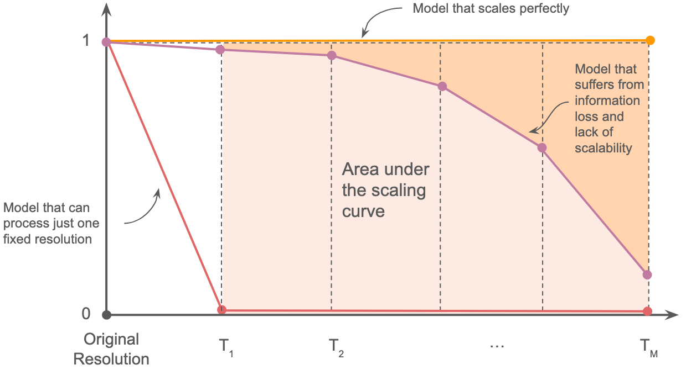

# Can't Find Waldo: Evaluating VLMs' Sensitivity to Image Resolution and Detail Level

This repository hosts the code for *Evaluating VLMs' Sensitivity to Image Resolution and Detail Level*, controlled evaluation framework that disentangles resolution-related performance degradation from task difficulty through semantics-preserving transformations.


## Model Evaluation
We design an evaluation setup in which image variants share identical semantic content but differ in their pixel resolution and tokenization properties. 
### Pixel Scaling
In this scenario, we generate higher-resolution variants of each image using a super-resolution model, specifically Real-ESRGAN. 

```
python main_scale.py
```

### Token Scaling
In the second scenario, we increase the image resolution by embedding the original image within a larger blank canvas. While the pixel content of the original image remains unchanged, the overall image size increases, leading to a larger number of vision tokens and a different spatial token arrangement.

```
python main_field.py
```

### Evaluation Protocol

Depending on the benchmark and it's evaluation protocol, we propose a mixture of rule-based and LLM-as-a-judge evaluation based on GPT-4o-mini. To run the evaluation:

```
python src/evaluate.py
```

## Evaluation Metrics
We introduce two complementary metrics to quantify vision encoders' scaling behavior across resolutions, enabling fair comparison of VLMs, independent of architecture or baseline performance. 

Example for metrics computation: **notebooks/compute_metrics.ipynb**

### Area Under the Scaling Curve (AUSC)
AUSC measures a model's ability to maintain accuracy across progressive transformations (e.g., resolution changes) by computing the area under the accuracy curve for examples initially answered correctly, where 1 indicates perfect scaling robustness and 0 indicates complete brittleness.



```
from src.metrics import AUSC

results_path = "PATH_TO_RESULTS_FOLDER"
model_id = "MODEL_ID"

AUSC = AUSC(model_id, results_path)
```

### Prediction Variance Score (PVS)

PVS quantifies whether resolution changes can "rescue" initially incorrect predictions, revealing sensitivity to tokenization or visual encoding artifacts.

```
from src.metrics import PVS

results_path = "PATH_TO_RESULTS_FOLDER"
model_id = "MODEL_ID"

PVS = PVS(model_id, results_path)
```
